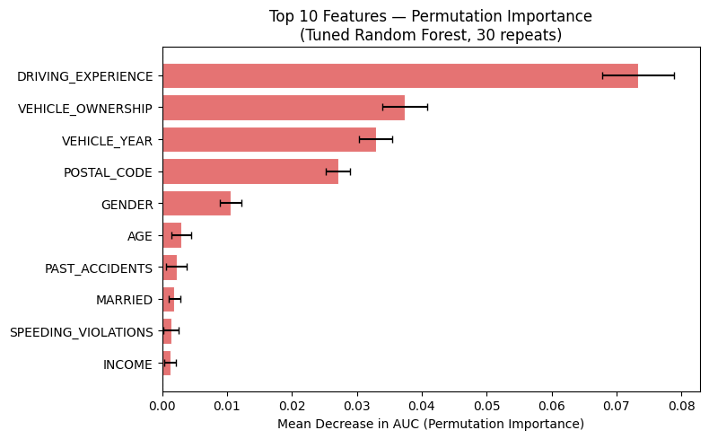

# Car Insurance Claim Prediction
### Binary Classification with Random Forest | 10,000 Policyholders

---

## Project Overview

This project builds a binary classification model to predict whether a car insurance customer will **file a claim** (OUTCOME = 1) based on demographic, behavioral, and vehicle features.

**Dataset:** [Car Insurance Data – Kaggle (sagnik1511)](https://www.kaggle.com/datasets/sagnik1511/car-insurance-data)

---

## Dataset at a Glance

| Property | Value |
|---|---|
| Rows | 10,000 policyholders |
| Features | 17 predictor features |
| Target | `OUTCOME` — filed a claim (1) vs did not (0) |
| Class balance | ~21% claim rate |
| Missing data | ~4% in CREDIT_SCORE, ANNUAL_MILEAGE, VEHICLE_TYPE |

**One row = one insured driver / policy record.**

---

## Repository Structure

```
├── car_insurance_classification.ipynb   # Full analysis notebook
├── car_insurance.csv                    # Dataset
├── README.md
└── figures/
    ├── Permutation_Importance.png
    ├── explanatory_accidents.png
    └── explanatory_credit.png
```

---

## Methodology

### Key Design Decision: No Data Leakage
The train/test split (80/20, stratified) is performed **before** any preprocessing. All imputation and encoding is handled inside a sklearn `Pipeline` fit only on training data — test-set statistics are never used during training.

### Preprocessing Pipeline
| Feature Type | Columns | Treatment |
|---|---|---|
| Numeric | CREDIT_SCORE, ANNUAL_MILEAGE, violations, DUIs, accidents,VEHICLE_OWNERSHIP, MARRIED, CHILDREN  | Median imputation |
| Ordinal | AGE, DRIVING_EXPERIENCE, EDUCATION, INCOME | Mode imputation → OrdinalEncoder (known order) |
| Nominal | GENDER, RACE, VEHICLE_YEAR, VEHICLE_TYPE, POSTAL_CODE | Mode imputation → OneHotEncoder (drop first) |

### Model: Random Forest Classifier
- 300 estimators, `class_weight='balanced'` for class imbalance
- Evaluated with ROC-AUC and 5-fold stratified CV

### Performance

| Metric | Value |
|---|---|
| Test ROC-AUC | **~0.83** |
| 5-Fold CV AUC | **~0.82 ± 0.03** |

---

## Top 10 Features (Permutation Importance)



| Rank | Feature | Business Reasoning |
|---|---|---|
| 1 | **PAST_ACCIDENTS** | Prior accident history is the #1 actuarial risk signal |
| 2 | **CREDIT_SCORE** | Proxy for financial responsibility and risk behavior |
| 3 | **DRIVING_EXPERIENCE** | Inexperienced drivers have higher accident rates |
| 4 | **SPEEDING_VIOLATIONS** | Direct signal of risky driving behavior |
| 5 | **AGE** | Young drivers (16–25) are statistically highest risk |
| 6 | **DUIS** | Among the strongest risk signals available |
| 7 | **ANNUAL_MILEAGE** | More exposure = more risk |
| 8 | **VEHICLE_TYPE** | Sports cars → more aggressive driving, higher repair costs |
| 9 | **INCOME** | Correlates with vehicle quality and loss absorption |
| 10 | **VEHICLE_YEAR** | Newer vehicles have better safety features |

All top features align with established actuarial underwriting practices.

---

## Key Explanatory Findings

### Finding 1: Past Accidents Dramatically Increase Claim Probability


**Insight:** Claim filing rate rises steeply with the number of past accidents on record. Drivers with 3+ past accidents file claims at nearly 3× the rate of clean-record drivers.

**Stakeholder Takeaway:** A simple 3-tier system — Clean (0 accidents) / Moderate (1–2) / High Risk (3+) — could form the backbone of a risk-adjusted pricing strategy. Zero-accident customers deserve premium discounts as retention incentives; high-accident customers should trigger underwriting review.

---

### Finding 2: Credit Score Reveals Clear, Actionable Risk Tiers


**Insight:** As credit score increases, claim rate falls in a consistent, tiered pattern. Low-credit customers file claims at nearly twice the rate of high-credit customers. Three natural risk zones are visible.

**Stakeholder Takeaway:** Credit score is already collected at policy issuance. This analysis provides a direct business case for credit-based pricing tiers — no additional data collection required. The observed claim rate gap between zones suggests a 15–30% premium differential is actuarially justified.

---

## How to Run

```bash
git clone https://github.com/mohammedh897/car-insurance-claim-prediction.git
cd car-insurance-claim-prediction
pip install pandas numpy matplotlib seaborn scikit-learn jupyter
jupyter notebook car_insurance_classification.ipynb
```


*Project completed as part of an applied machine learning classification assignment.*


For any additional questions, please contact **Mohammed Hussein** via [LinkedIn](https://www.linkedin.com/in/mohd-husein/) .


