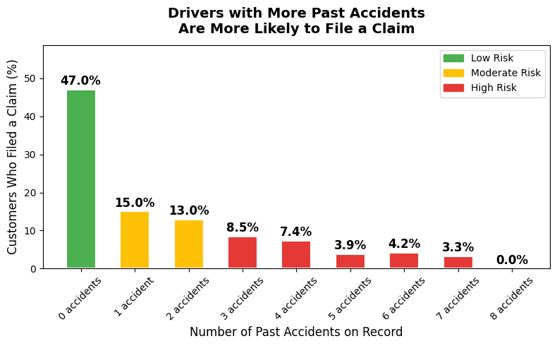
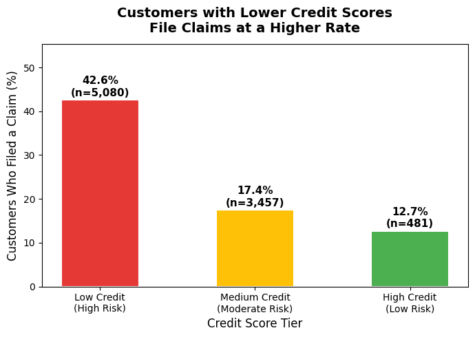
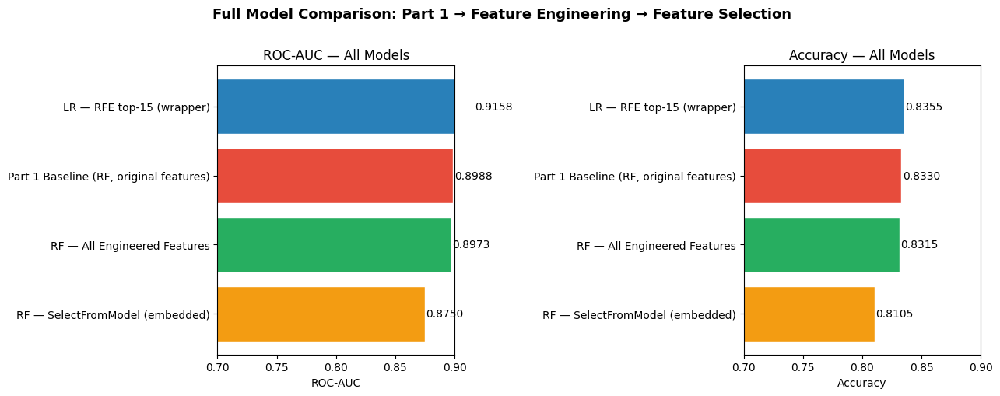
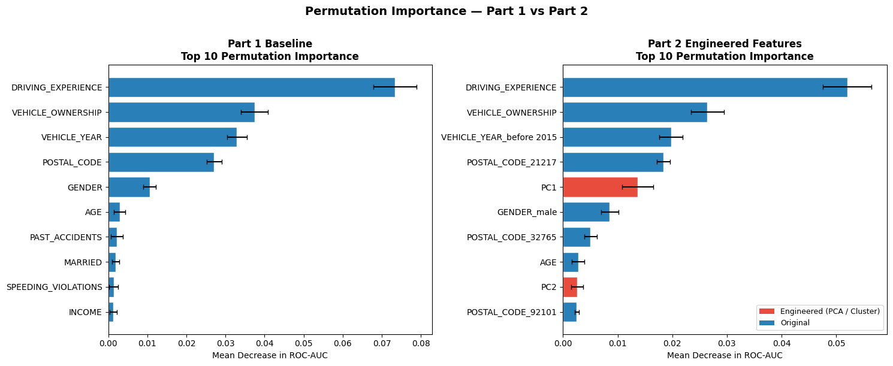

# Car Insurance Claim Prediction
### Binary Classification with Random Forest | 10,000 Policyholders

---

## Project Overview

This project builds a binary classification model to predict whether a car insurance customer will **file a claim** (OUTCOME = 1) based on demographic, behavioral, and vehicle features. It is structured in two parts:

- **Part 1:** EDA, preprocessing pipeline, and baseline model (Tuned Random Forest)
- **Part 2:** Feature engineering, feature selection, and permutation importance analysis

**Dataset:** [Car Insurance Data – Kaggle (sagnik1511)](https://www.kaggle.com/datasets/sagnik1511/car-insurance-data)

---

## Dataset at a Glance

| Property | Value |
|---|---|
| Rows | 10,000 policyholders |
| Features | 17 predictor features |
| Target | `OUTCOME` — filed a claim (1) vs did not (0) |
| Class balance | ~31% claim rate |
| Missing data | ~4% in CREDIT_SCORE, ANNUAL_MILEAGE, VEHICLE_TYPE |

**One row = one insured driver / policy record.**

---

## Repository Structure

```
├── Project2_Part1.ipynb                 # Part 1: EDA, preprocessing, baseline model
├── Project2_Part2.ipynb                 # Part 2: Feature engineering & selection
├── README.md
└── figures/
    ├── explanatory_accidents.png
    ├── explanatory_credit.png
    ├── part2_model_comparison.png
    └── part2_permutation_comparison.png
```

---

## Methodology

### Key Design Decision: No Data Leakage
The train/test split (80/20, stratified) is performed **before** any preprocessing. All imputation, encoding, scaling, PCA, and clustering are fit only on training data — test-set statistics are never used during training.

### Preprocessing Pipeline
| Feature Type | Columns | Treatment |
|---|---|---|
| Numeric | CREDIT_SCORE, ANNUAL_MILEAGE, violations, DUIs, accidents, VEHICLE_OWNERSHIP, MARRIED, CHILDREN | Median imputation |
| Ordinal | AGE, DRIVING_EXPERIENCE, EDUCATION, INCOME | Mode imputation → OrdinalEncoder (known order) |
| Nominal | GENDER, RACE, VEHICLE_YEAR, VEHICLE_TYPE, POSTAL_CODE | Mode imputation → OneHotEncoder (drop first) |

---

## Part 1 — Baseline Model

### Model: Tuned Random Forest Classifier
- Hyperparameters tuned via `RandomizedSearchCV` (30 iterations, 5-fold CV)
- `class_weight='balanced'` to handle class imbalance
- Evaluated with ROC-AUC and accuracy

### Performance

| Metric | Value |
|---|---|
| Test ROC-AUC | **0.8988** |
| Test Accuracy | **0.8330** |

---

## Key Explanatory Findings (Part 1)

### Finding 1: Past Accidents Dramatically Increase Claim Probability



**Insight:** Claim filing rate rises steeply with the number of past accidents on record. Drivers with 3+ past accidents file claims at nearly 3× the rate of clean-record drivers.

**Stakeholder Takeaway:** A simple 3-tier system — Clean (0 accidents) / Moderate (1–2) / High Risk (3+) — could form the backbone of a risk-adjusted pricing strategy. Zero-accident customers deserve premium discounts as retention incentives; high-accident customers should trigger underwriting review.

---

### Finding 2: Credit Score Reveals Clear, Actionable Risk Tiers



**Insight:** As credit score increases, claim rate falls in a consistent, tiered pattern. Low-credit customers file claims at nearly twice the rate of high-credit customers. Three natural risk zones are visible.

**Stakeholder Takeaway:** Credit score is already collected at policy issuance. This analysis provides a direct business case for credit-based pricing tiers — no additional data collection required. The observed claim rate gap between zones suggests a 15–30% premium differential is actuarially justified.

---

## Part 2 — Feature Engineering & Feature Selection

### Feature Engineering

Two methods were applied on top of the Part 1 preprocessing pipeline:

- **PCA (3 components):** Captured 40.1% of total variance (PC1: 23.5%, PC2: 9.1%, PC3: 7.5%), compressing correlated risk signals into compact axes. Fit on training data only → `pca.transform(X_test)` applied to test set.
- **K-Means Clustering (k=4):** Grouped customers into 4 risk segments based on their feature profiles. Fit on training data only → `kmeans.predict(X_test)` applied to test set.

The final engineered feature matrix combined the original 19 preprocessed features + PC1, PC2, PC3 + Cluster label = **23 total features**.

### Feature Selection

| Method | Type | Features Kept | ROC-AUC |
|---|---|---|---|
| SelectFromModel (RF importance ≥ mean) | Embedded | 11 of 23 | 0.8750 |
| **RFE with Logistic Regression (top 15)** | Wrapper | 15 of 23 | **0.9158** |

The RFE-selected features included: `ANNUAL_MILEAGE`, `DUIS`, `VEHICLE_OWNERSHIP`, `MARRIED`, `CHILDREN`, `AGE`, `DRIVING_EXPERIENCE`, `GENDER_male`, `RACE_minority`, `VEHICLE_YEAR_before 2015`, three POSTAL_CODE dummies, **PC1**, and **PC3**.

### Full Model Comparison



The chart above compares ROC-AUC and Accuracy across all four models. The Logistic Regression with RFE-selected features is the clear winner — achieving the highest ROC-AUC of **0.9158** despite being a simpler model than the Random Forest. This demonstrates that thoughtful feature selection can outperform raw model complexity.

| Model | ROC-AUC | Accuracy |
|---|---|---|
| **LR — RFE top-15 (wrapper)** ⭐ | **0.9158** | **0.8355** |
| Part 1 Baseline (Tuned RF) | 0.8988 | 0.8330 |
| RF — All Engineered Features | 0.8973 | 0.8315 |
| RF — SelectFromModel (embedded) | 0.8750 | 0.8105 |

---

## Permutation Importance — Part 1 vs Part 2



The side-by-side chart above shows how the top 10 most important features shifted after feature engineering. Red bars on the right indicate engineered features (PCA components) that are new to Part 2.

| Rank | Part 1 Feature | Importance | Part 2 Feature | Importance | New? |
|---|---|---|---|---|---|
| 1 | DRIVING_EXPERIENCE | 0.073 | DRIVING_EXPERIENCE | 0.052 | |
| 2 | VEHICLE_OWNERSHIP | 0.037 | VEHICLE_OWNERSHIP | 0.026 | |
| 3 | VEHICLE_YEAR | 0.033 | VEHICLE_YEAR_before 2015 | 0.020 | |
| 4 | POSTAL_CODE | 0.027 | POSTAL_CODE_21217 | 0.018 | |
| 5 | GENDER | 0.011 | **PC1** | **0.014** | ✅ |
| 6 | AGE | 0.003 | GENDER_male | 0.009 | |
| 7 | PAST_ACCIDENTS | 0.002 | POSTAL_CODE_32765 | 0.005 | |
| 8 | MARRIED | 0.002 | AGE | 0.003 | |
| 9 | SPEEDING_VIOLATIONS | 0.001 | **PC2** | **0.003** | ✅ |
| 10 | INCOME | 0.001 | POSTAL_CODE_92101 | 0.003 | |

**Key takeaways:**
- The core top-4 features are identical across both parts — confirming they are stable, genuine predictors
- **PC1 (rank 5) and PC2 (rank 9)** are new engineered features that entered the top 10, displacing PAST_ACCIDENTS, MARRIED, SPEEDING_VIOLATIONS, and INCOME
- The slight drop in absolute importance values for original features (e.g. DRIVING_EXPERIENCE: 0.073 → 0.052) is expected — the PCA components now absorb some of the variance those features previously carried alone

---

## How to Run

```bash
git clone https://github.com/mohammedh897/car-insurance-claim-prediction.git
cd car-insurance-claim-prediction
pip install pandas numpy matplotlib seaborn scikit-learn jupyter
jupyter notebook Project2_Part1.ipynb   # Run Part 1 first
jupyter notebook Project2_Part2.ipynb   # Then Part 2
```

*Project completed as part of an applied machine learning classification assignment.*

For any additional questions, please contact **Mohammed Hussein** via [LinkedIn](https://www.linkedin.com/in/mohd-husein/).
