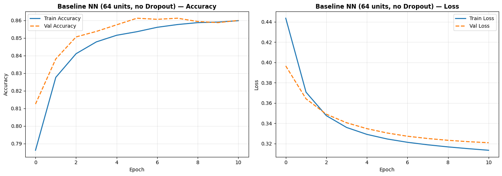
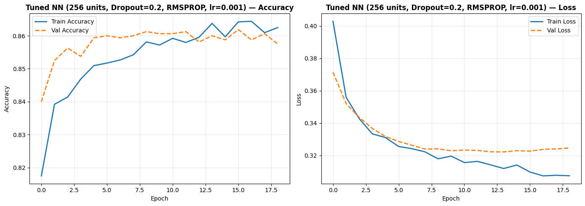
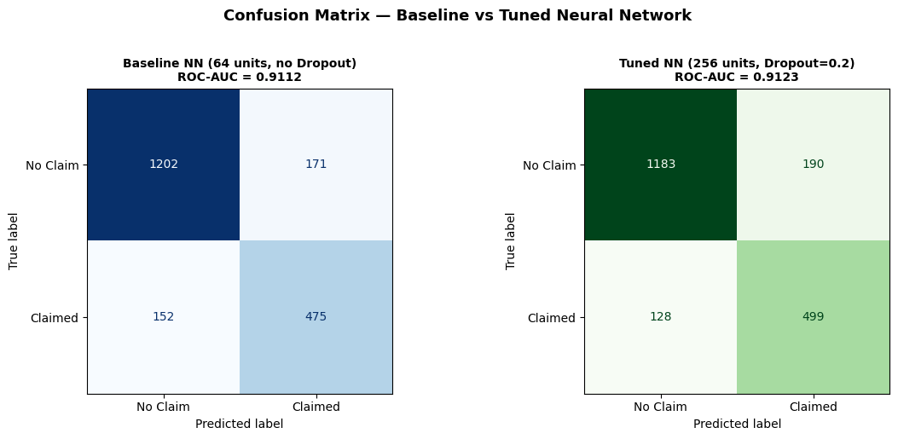
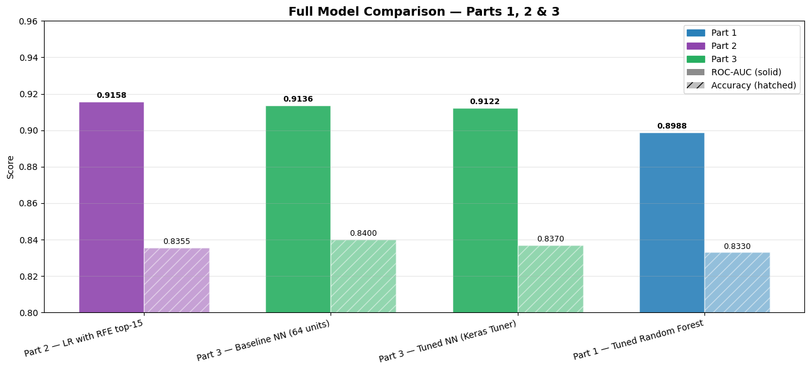

# Car Insurance Claim Prediction
### Binary Classification with Random Forest, Logistic Regression & Neural Networks | 10,000 Policyholders

---

## Project Overview

This project builds a binary classification model to predict whether a car insurance customer will **file a claim** (OUTCOME = 1) based on demographic, behavioral, and vehicle features. Structured in three parts:

- **Part 1:** EDA, preprocessing pipeline, and baseline model (Tuned Random Forest)
- **Part 2:** Feature engineering (PCA + K-Means), feature selection (SelectFromModel + RFE), permutation importance
- **Part 3:** Neural network baseline + Keras Tuner hyperparameter optimization (ROC-AUC objective)

**Dataset:** [Car Insurance Data – Kaggle (sagnik1511)](https://www.kaggle.com/datasets/sagnik1511/car-insurance-data)

---

## Dataset at a Glance

| Property | Value |
|---|---|
| Rows | 10,000 policyholders |
| Features | 17 predictor features |
| Target | `OUTCOME` — filed a claim (1) vs did not (0) |
| Class balance | ~31% claim rate |
| Missing data | ~4% in CREDIT_SCORE, ANNUAL_MILEAGE, VEHICLE_TYPE |

---

## Repository Structure

```
├── Project2_Part1.ipynb
├── Project2_Part2.ipynb
├── Project2_Part3.ipynb
├── README.md
└── figures/
    ├── explanatory_accidents.png
    ├── explanatory_credit.png
    ├── part2_model_comparison.png
    ├── part2_permutation_comparison.png
    ├── part3_baseline_history.png
    ├── part3_tuned_history.png
    ├── part3_baseline_cm.png
    ├── part3_tuned_cm.png
    ├── part3_cm_comparison.png
    └── part3_model_comparison.png
```

---

## Methodology

### Key Design Decision: No Data Leakage
The train/test split (80/20, stratified) is performed **before** any preprocessing. All imputation, encoding, scaling, PCA, and clustering are fit only on training data.

### Preprocessing Pipeline
| Feature Type | Columns | Treatment |
|---|---|---|
| Numeric | CREDIT_SCORE, ANNUAL_MILEAGE, violations, DUIs, accidents, VEHICLE_OWNERSHIP, MARRIED, CHILDREN | Median imputation + StandardScaler |
| Ordinal | AGE, DRIVING_EXPERIENCE, EDUCATION, INCOME | Mode imputation + OrdinalEncoder (known order) |
| Nominal | GENDER, RACE, VEHICLE_YEAR, VEHICLE_TYPE, POSTAL_CODE | Mode imputation + OneHotEncoder (drop first) |

---

## Part 1 — Baseline Model

### Model: Tuned Random Forest Classifier
- Hyperparameters tuned via `RandomizedSearchCV` (30 iterations, 5-fold CV)
- `class_weight='balanced'` to handle class imbalance

| Metric | Value |
|---|---|
| Test ROC-AUC | **0.8988** |
| Test Accuracy | **0.8330** |

---

## Key Explanatory Findings (Part 1)

### Finding 1: Past Accidents Dramatically Increase Claim Probability


Claim filing rate rises steeply with past accidents. Drivers with 3+ past accidents file claims at nearly 3x the rate of clean-record drivers. A simple 3-tier system (Clean / Moderate / High Risk) could form the backbone of risk-adjusted pricing.

### Finding 2: Credit Score Reveals Clear, Actionable Risk Tiers


As credit score increases, claim rate falls in a consistent tiered pattern. Low-credit customers file claims at nearly twice the rate of high-credit customers — providing direct business case for credit-based pricing tiers with no additional data collection required.

---

## Part 2 — Feature Engineering & Feature Selection

### Feature Engineering
- **PCA (3 components):** Captured 40.1% of total variance. Fit on training data only.
- **K-Means Clustering (k=4):** 4 risk segments. Fit on training data only.

Final engineered matrix: 19 preprocessed + PC1/PC2/PC3 + Cluster = **23 total features**.

### Feature Selection

| Method | Type | Features Kept | ROC-AUC |
|---|---|---|---|
| SelectFromModel (RF importance >= mean) | Embedded | 11 of 23 | 0.8750 |
| **RFE with Logistic Regression (top 15)** | Wrapper | 15 of 23 | **0.9158** |

### Part 2 Model Comparison


| Model | ROC-AUC | Accuracy |
|---|---|---|
| **LR — RFE top-15** | **0.9158** | **0.8355** |
| Part 1 Baseline (Tuned RF) | 0.8988 | 0.8330 |
| RF — All Engineered Features | 0.8973 | 0.8315 |
| RF — SelectFromModel (embedded) | 0.8750 | 0.8105 |

---

## Permutation Importance — Part 1 vs Part 2


| Rank | Part 1 Feature | Importance | Part 2 Feature | Importance | New? |
|---|---|---|---|---|---|
| 1 | DRIVING_EXPERIENCE | 0.073 | DRIVING_EXPERIENCE | 0.052 | |
| 2 | VEHICLE_OWNERSHIP | 0.037 | VEHICLE_OWNERSHIP | 0.026 | |
| 3 | VEHICLE_YEAR | 0.033 | VEHICLE_YEAR_before 2015 | 0.020 | |
| 4 | POSTAL_CODE | 0.027 | POSTAL_CODE_21217 | 0.018 | |
| 5 | GENDER | 0.011 | **PC1** | **0.014** | YES |
| 6 | AGE | 0.003 | GENDER_male | 0.009 | |
| 7 | PAST_ACCIDENTS | 0.002 | POSTAL_CODE_32765 | 0.005 | |
| 8 | MARRIED | 0.002 | AGE | 0.003 | |
| 9 | SPEEDING_VIOLATIONS | 0.001 | **PC2** | **0.003** | YES |
| 10 | INCOME | 0.001 | POSTAL_CODE_92101 | 0.003 | |

---

## Part 3 — Neural Network + Keras Tuner

### Architecture

All Part 3 models take the 23-feature engineered matrix as input. The output layer is a **single sigmoid unit** — outputting P(claim=1) for binary classification.

**Baseline:** `Input(23) → Dense(64, ReLU) → Dense(1, Sigmoid)`  
**Tuned (best):** `Input(23) → Dense(256, ReLU) → Dropout(0.2) → Dense(1, Sigmoid)`

### Baseline Neural Network

The baseline (64 units, no Dropout, Adam default lr) converged in **11 epochs** via early stopping (patience=5, monitor=val_accuracy).



| Metric | Value |
|---|---|
| Test ROC-AUC | **0.9112** |
| Test Accuracy | **0.8385** |

### Keras Tuner — Critical Design Decision

The tuner optimizes `kt.Objective('val_auc', direction='max')` with `EarlyStopping(monitor='val_auc')`. With ~31% claim rate, `val_accuracy` is a misleading optimization target — it can be gamed by skewing predictions toward the majority class. ROC-AUC is invariant to class imbalance and measures true ranking quality, making it the correct objective for this problem.

`tf.keras.metrics.AUC(name='auc')` is added to model metrics so `val_auc` is tracked during training.

### Tuned Parameters

| Parameter | Search Space | Best Value |
|---|---|---|
| Hidden units | {64, 128, 256} | **256** |
| Dropout rate | 0.1 to 0.4 (step 0.1) | **0.20** |
| Optimizer | {adam, rmsprop, sgd} | **RMSprop** |
| Learning rate | {0.01, 0.005, 0.002, 0.001} | **0.001** |

### Tuned Model — Training History



### Confusion Matrix Comparison



### Full Project Model Comparison



| Model | ROC-AUC | Accuracy | Part |
|---|---|---|---|
| **LR — RFE top-15** | **0.9158** | 0.8355 | 2 |
| Tuned NN (Keras Tuner) | **0.9123** | 0.8410 | 3 |
| Baseline NN (64 units) | 0.9112 | 0.8385 | 3 |
| Tuned Random Forest | 0.8988 | 0.8330 | 1 |
| RF — All Engineered Features | 0.8973 | 0.8315 | 2 |
| RF — SelectFromModel | 0.8750 | 0.8105 | 2 |

---

## How to Run

```bash
git clone https://github.com/mohammedh897/car-insurance-claim-prediction.git
cd car-insurance-claim-prediction
pip install pandas numpy matplotlib seaborn scikit-learn tensorflow keras-tuner jupyter
mkdir -p figures
jupyter notebook Project2_Part1.ipynb
jupyter notebook Project2_Part2.ipynb
jupyter notebook Project2_Part3.ipynb
```

*Project completed as part of an applied machine learning classification assignment.*

For any additional questions, please contact **Mohammed Hussein** via [LinkedIn](https://www.linkedin.com/in/mohd-husein/).
